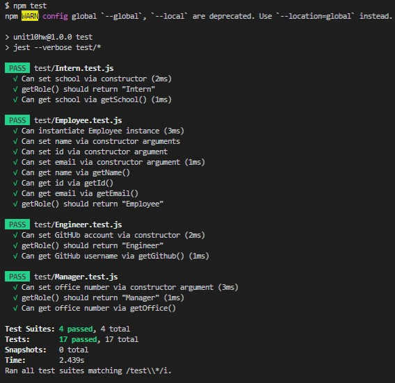
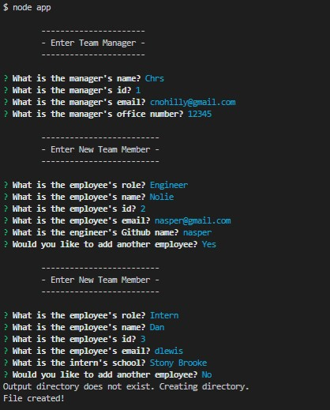

# 10 Object-Oriented Programming: Team Profile Generator

This project was to build a command-line application using inquirer to take information from a user to build their development team and provide information for each team member. The application starts by asking for the information for the team manager, then proceeds to ask for information for each engineer or intern for the team. After all the team members have been submitted, an HTML webpage is generated to display the team in their own individual cards with their information. 

**Note**: Much of the code used in this project was supplied by the instructor.

## User Story

```md
AS A manager
I WANT to generate a webpage that displays my team's basic info
SO THAT I have quick access to their emails and GitHub profiles
```

## Acceptance Criteria

```md
GIVEN a command-line application that accepts user input
WHEN I am prompted for my team members and their information
THEN an HTML file is generated that displays a nicely formatted team roster based on user input
WHEN I click on an email address in the HTML
THEN my default email program opens and populates the TO field of the email with the address
WHEN I click on the GitHub username
THEN that GitHub profile opens in a new tab
WHEN I start the application
THEN I am prompted to enter the team manager’s name, employee ID, email address, and office number
WHEN I enter the team manager’s name, employee ID, email address, and office number
THEN I am presented with a menu with the option to add an engineer or an intern or to finish building my team
WHEN I select the engineer option
THEN I am prompted to enter the engineer’s name, ID, email, and GitHub username, and I am taken back to the menu
WHEN I select the intern option
THEN I am prompted to enter the intern’s name, ID, email, and school, and I am taken back to the menu
WHEN I decide to finish building my team
THEN I exit the application, and the HTML is generated
```

## Mock-Up

The following image shows the generated HTML’s appearance and functionality. The styling in the image is just an example, so feel free to add your own styles:


## Product

The application can be run by using the following command:

```bash
node index.js
```

Demonstration of the application can be seen in this video: [Team Profile Generator Demo](https://youtu.be/JYsSgNNiTDA)

GIF of demonstration:


Image of tests passing: 



Example of application:




